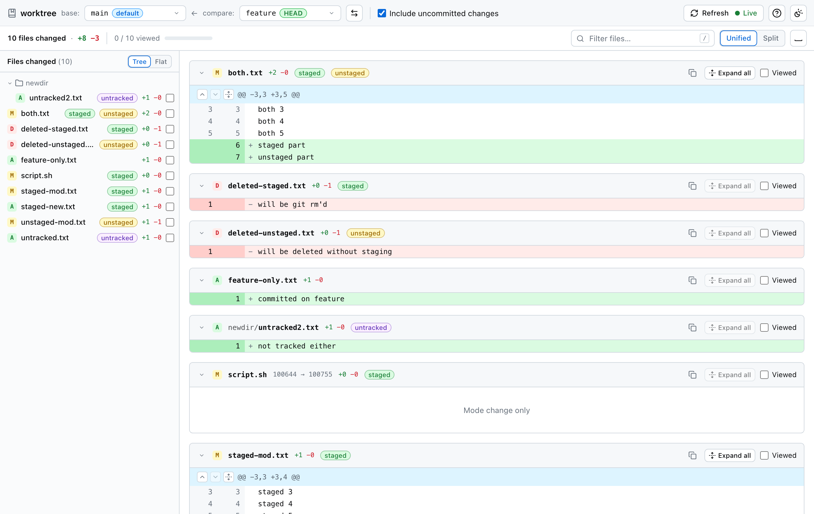
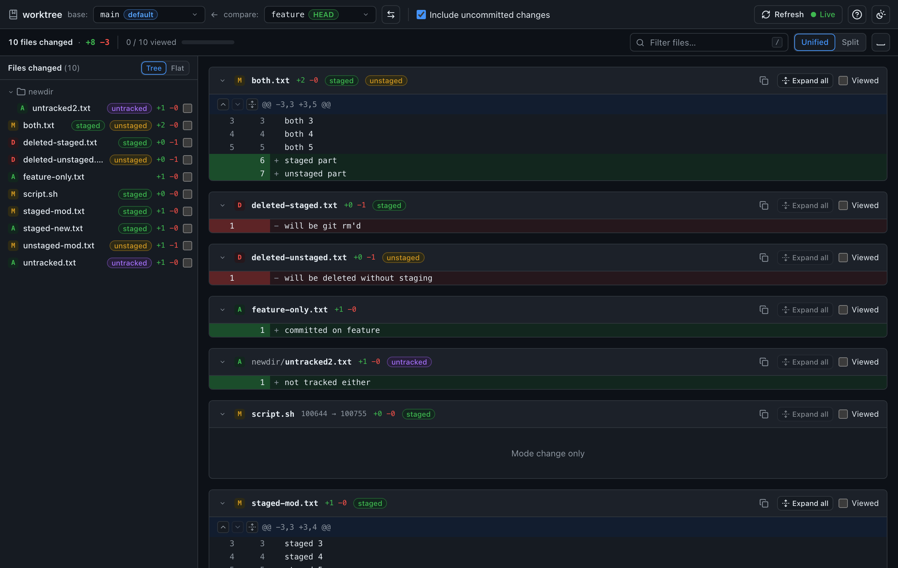

# diffgit

**A GitHub-style branch diff for the repository on your disk, including the work you have not
committed yet, running entirely in your browser.** Open a local git repository, pick a base and a
compare branch, and read the three-dot diff (`base...compare`) the way a pull request shows it:
file tree that groups your files by layer (staged / unstaged / untracked, then what is already
committed on the branch), unified or split hunks with syntax colours and word-level marks, rename
detection, "viewed" ticks that survive a reload, and live refresh as you edit. Nothing is uploaded
and nothing is written: the page reads the folder through the File System Access API and the
Content-Security-Policy forbids every network request after the page has loaded.

<p align="center">
  
  
</p>

Live at **https://diffgit.com**.

## What it does

| | |
|---|---|
| **Compare anything** | Branches, remotes, tags, stashes and free-typed revisions (`a1b2c3d`, `HEAD~3`, `v2.3.0^`, `stash@{1}`) in either picker, three-dot or two-dot, with the pair in the URL (`#compare=a...b`). |
| **Files** | The grouped file tree (conflicts, staged, unstaged, untracked, committed, and an opt-in **Hidden** group that says *why* each row is hidden), unified or split hunks, renames, images, binaries, large-file gates. |
| **History** | A commit list with a lane graph, commit details (author, committer, parents, signature, **git notes**), per-commit and range diffs, a **Stack** view of what the branch adds, and the **reflog** with `unreachable` marks. |
| **Blame and file history** | `Diff \| Blame \| History` on every file card: blame with an age heat ramp, and the path's history with renames followed. |
| **Branches** | Active / stale / tags, ahead-behind against the upstream and the base, merged and push/pull hints, and a read-only **rebase preflight** that predicts which commits will conflict. |
| **Insights** | Hotspots, a 52-week activity heatmap and contributors (`.mailmap` honoured, bots separated), cached per tip. |
| **Search** | In the command palette (`⌘K`): commits (`>`), the working tree (`grep:`) and a pickaxe over history (`-S`), literal by default, regex on request. |
| **Secrets** | Every uncommitted change is scanned for credentials before you share it; findings are masked everywhere, including in exports, which are blocked until you say otherwise. |
| **Export** | Copy or save a `.patch` that `git apply` accepts, a self-contained review snapshot (`.html`), the file list as Markdown, or the stats line. |
| **Bisect** | A strip that halves the range for you and tells you which commit to check out next. Read-only: you run the checkout. |
| **Home** | A dashboard card per recent repository — branch, ahead/behind, layer counts, operation in progress, last commit. |
| **Compatibility** | Submodules (recorded vs checked-out commit, url, open as its own repository), linked **worktrees**, **Git LFS** pointers, colocated **jujutsu** workspaces, and interrupted merges, rebases, cherry-picks and reverts with a banner and three-way conflict cards. |
| **Install and patches** | Installable as an app, works offline, and opens a `.patch` or `.diff` file — dropped, picked or handed over by the operating system — with no repository at all. |

## How to use

1. **Open** — click *Open repository* (or press `o`) and pick the folder that contains `.git`.
   Chrome asks for read access to that folder; grant it. Recently opened repositories appear on the
   home screen and only need a click to re-authorise.
2. **Choose branches** — *base* defaults to the default branch (`origin/HEAD`, `main` or `master`),
   *compare* to the checked-out branch. Either picker lists local and remote branches with search;
   the ⇄ button swaps them. The diff is `merge-base(base, compare)` → `compare`, exactly like a pull
   request.
3. **Read and work** — *Include uncommitted changes* (on by default when *compare* is the checked-out
   branch) layers the index and the working tree on top of the commits, and the sidebar groups the
   files by that layer, with git's own two-letter code on the rows the group alone does not explain
   (`MM` for staged, then edited again). Tick *Viewed* as you go, `j`/`k` to move between files, `s` to
   switch split/unified, `/` to filter, `?` for every shortcut. The diff refreshes itself when files
   change (Live), falls back to polling if the browser cannot watch the folder, and `Shift+R`
   forces a full re-read.
4. **Go further** — `1`–`4` switch between *Files*, *History*, *Branches* and *Insights*; `b` and `h`
   turn the active file card into blame or its own history; `e` opens the export menu. Everything
   else — search, worktrees, bisect, the rebase preflight, opening a patch file, snapshot mode — is
   one keystroke away in the command palette (`⌘K` / `Ctrl+K`). Nothing is hidden in a menu you have
   to find.

## Privacy model

- **Nothing leaves the browser.** Repository content is read into a Web Worker and rendered on the
  page. The served CSP has `connect-src 'none'`, so the browser itself blocks any request from the
  page or its workers; an end-to-end test asserts zero network requests while a repository is open.
- **Nothing is written.** The folder is opened in read-only mode and the engine's filesystem
  adapter has no working write path (every write method throws). A mtime-based proof on real
  repositories is part of the release checklist.
- **Stored locally, only:** the directory handles and names of up to 20 recent repositories, the
  last branch pair per repository, "viewed" marks (keyed by repository, refs, path and blob ids),
  view preferences, and a derived cache of blame, file history, insights and repository summaries
  keyed by commit id (clearable from the help dialog, which shows its size). No file contents.
  Clear everything with the browser's *Delete site data*.
- **Exports go where you send them.** A `.patch` or a review snapshot is written through the
  browser's own download, never into your repository, and the secret scan blocks the write until
  you confirm. Nothing is uploaded on the way.
- No analytics, no cookies, no third-party scripts. Details: [docs/privacy.md](docs/privacy.md).

## Supported browsers

**Live mode needs a desktop Chromium browser**: Chrome, Edge, Brave, Arc (Chrome 86 or newer). It
uses `showDirectoryPicker()` from the File System Access API to keep a handle on your folder, which
is what lets the diff refresh itself as you edit; change detection uses `FileSystemObserver` where
available (Chrome 129+) and otherwise polls `.git` and the index.

**Firefox and Safari get snapshot mode.** They do not ship the File System Access API, so the home
screen offers *Open a repository once* instead: the folder is read through
`<input webkitdirectory>` in one pass and everything works against that snapshot — the diff, the
history, blame, search, insights and export. There is no Live dot and no Recent list, because there
is no handle to watch or remember; a `Snapshot mode · read at 14:02 · Re-open to refresh` tag says
so, and re-opening the folder is one click. Folders above 100,000 entries are refused with advice
rather than freezing the tab.

## Limitations

Every item below is either refused with an explanation, shown as a banner, or documented here
because git behaves the same way. Error and warning codes are listed in
[docs/errors.md](docs/errors.md).

| Area | Behaviour |
|---|---|
| Linked worktrees (`.git` is a `gitdir:` file), bare repositories, reftable, SHA-256 object format, `objects/info/alternates`, partial (promisor) clones, packs over 1 GB | Refused on open with a message naming the reason (`WORKTREE_GITDIR`, `BARE_REPO`, `REFTABLE`, `OBJECT_FORMAT_SHA256`, `ALTERNATES`, `PARTIAL_CLONE`, `PACK_TOO_LARGE`). Open the main checkout or a full clone. |
| Listing linked worktrees | Opening the **main** checkout lists every worktree (palette → *Worktrees*, or click the repository name) with its branch and `prunable` state. Two columns are honest gaps: the path of the folder you opened is not one the browser can tell you, and a linked worktree's recorded path is never verified — checking it would mean reading outside the folder you granted. Opening another checkout needs its own pick, and is still refused as above. |
| Submodules | The card shows the commit the superproject records, the commit actually checked out under the folder you picked, the `.gitmodules` url and whether the two agree. Whether the submodule's own working tree is dirty is **not** computed. *Open as its own repository* works when the submodule's `.git` is a directory; the pointer file git writes today (`gitdir: ../.git/modules/x`) is the refusal above, and the card says so instead of sending you to an error screen. |
| Colocated `jj` (jujutsu) repositories | Detected (`.jj/` beside `.git/`), labelled `jj colocated` next to the repository name, and read as git reads them. The detached HEAD jj leaves behind is normal and is not reported as a problem; jj's own operation log is out of scope. |
| Split index (`core.splitIndex`) | Not supported: the diff shows committed changes only, with a banner (`SPLIT_INDEX`). |
| Sparse index / sparse checkout | Tracked changes are correct; untracked-file detection inside sparse directories is partial (`SPARSE_INDEX`). |
| Index over 200,000 entries | Working-tree scan disabled, committed-only mode with a banner (`INDEX_TOO_LARGE`). |
| More than 5,000 untracked files | The list is cut off with a banner (`UNTRACKED_CAPPED`). |
| Mode changes | Staged mode changes (e.g. `100644 → 100755`) are shown. A `chmod` that is not yet staged is **not** detected: the working-tree scan compares content, not modes. |
| Symlinks and submodules | Compared at the committed/staged level (a symlink by its target path, a submodule by its commit id). Edits to them in the working tree are not detected. |
| Everything is read-only | diffgit never writes to your repository — not to resolve a conflict, not to bisect, not to rebase. The bisect strip, the rebase preflight and the conflict card tell you what git would do and hand you the command to run; you run it. |
| `core.autocrlf` | No normalisation is applied; line-ending-only changes may appear, flagged by an `AUTOCRLF` banner. |
| Global ignores (`core.excludesFile`, `~/.config/git/ignore`) | Not readable from the folder, so not applied: some globally ignored files may appear as untracked (`GLOBAL_EXCLUDES_UNAVAILABLE`). Built-in excludes (`.DS_Store`, `._*`, `Thumbs.db`, `desktop.ini`) are applied by default and can be turned off in the help dialog, which re-opens the repository. |
| `include` / `includeIf` in `.git/config` | Includes pointing outside the folder are skipped (`CONFIG_INCLUDE_SKIPPED`). |
| Renames and copies | Renames are detected like `git diff -M` (exact, then 50 % similarity, up to 1,000 × 1,000 candidate pairs; `RENAME_LIMIT` when exceeded). Copies (`-C`) are not detected. |
| Git LFS | A pointer is shown as a card naming the object and the size it claims, on both sides. The objects themselves are **never fetched** — diffgit contacts no LFS server and no network at all (`LFS_PRESENT`), so an LFS-tracked file's real content is not diffed. |
| Shallow clones | The merge base may differ from git's on a full clone (`SHALLOW`). |
| Racy edits | Edits within the same millisecond as the index write are detected with git's own racy-git rule; `Shift+R` re-hashes every file as belt-and-braces. |
| Encodings | Text is decoded as UTF-8 with replacement characters, as `git diff` shows it; no `working-tree-encoding` support (backlog B8). |

Size limits (surfaced as banners or gates, never silently):

| Limit | Behaviour |
|---|---|
| File over 1 MB on either side, or over 3,000 changed lines | Collapsed behind *Load diff*; counted in the totals. |
| File over 10 MB | Never rendered ("Diff too large"); raw bytes are never transferred (`TOO_LARGE`). |
| Binary files | "Binary file not shown" with sizes; *View as text* below 1 MB; images shown side by side. |
| More than 300 changed files | Sidebar and diff pane are virtualised; per-file stats stream in with the visible rows first. |
| Packs over 300 MB on disk or read | `PACK_LARGE` warning; over 1 GB refused. |

## Development

```
bun install
bun run dev                 # real engine in a worker; VITE_MOCK_ENGINE=1 bun run dev for the recorded mock
bun run check               # biome + tsc + engine tests (bun) + UI tests (vitest) + layering guards
bun run e2e                 # Playwright against vite preview with the production CSP
bun run perf                # perf budgets on the perf-5k fixture
bun run fixtures            # rebuild fixtures/ and git's own expected output (needs git + jq)
bun run deploy              # build → scripts/check-dist.sh → Cloudflare Pages
```

Layout, guards and conventions: [docs/contributing.md](docs/contributing.md). Design and decisions:
[Plan.md](Plan.md) (§0 decisions are final), [Design.md](Design.md), [docs/](docs/README.md).
Task board: [START.md](START.md).

## License

MIT.
